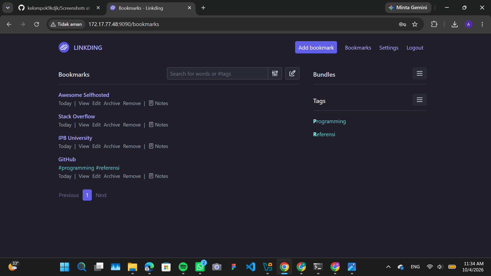
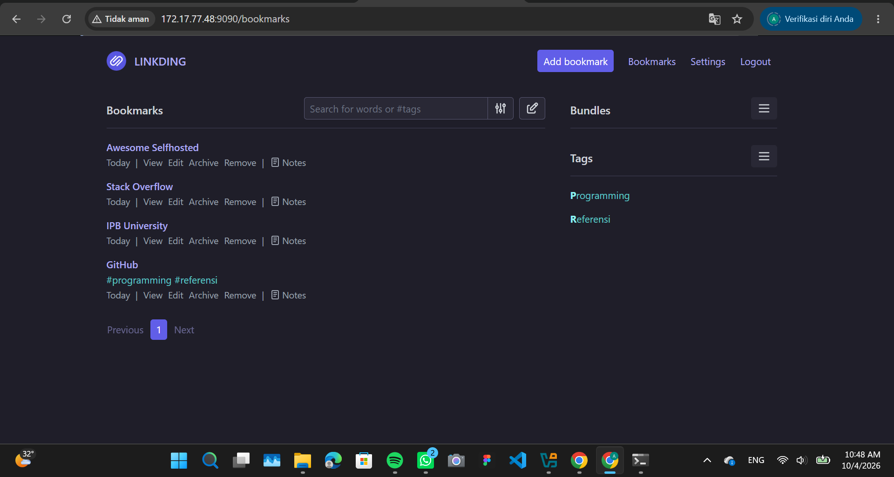

# Project KDJK: Implementasi Linkding

## Anggota Kelompok

- Azizah Az-Zahra (M0403241048)
- Mirabel Nasywa Rajendraputri (M0403241067)
- Muhammad Riady Hendrawan (M0403241103)
- Muhammad Fauzan Rizvi (M0403241142)
- Dini Aulia Wulandari (M0403241143)

---

## Navigasi

[**Sekilas Tentang**](#sekilas-tentang) |
[**Instalasi**](#instalasi) |
[**Konfigurasi**](#konfigurasi) |
[**Maintenance**](#maintenance) |
[**Otomatisasi**](#otomatisasi) |
[**Cara Pemakaian**](#cara-pemakaian) |
[**Pembahasan**](#pembahasan) |
[**Referensi**](#referensi)

---

# Sekilas Tentang

Linkding merupakan aplikasi web self-hosted yang digunakan untuk menyimpan dan mengelola bookmark atau URL secara mandiri. Aplikasi ini berfokus pada pengelolaan bookmark dengan antarmuka yang sederhana dan ringan.

Linkding memungkinkan pengguna menyimpan bookmark, memberikan tag, melakukan pencarian, menambahkan catatan, serta mengelola bookmark yang telah disimpan. Selain itu, Linkding menyediakan fitur import dan export bookmark, REST API, browser extension, serta dukungan multi-user.

Linkding dirancang untuk dijalankan menggunakan container seperti Docker. Pada instalasi ini digunakan Docker dengan Docker Compose dan database SQLite sebagai database default.

Pada project ini, Linkding dipilih sebagai aplikasi web self-hosted untuk diinstal dan diuji pada VM lokal.

---

# Instalasi

## Kebutuhan Sistem

Sebelum melakukan instalasi Linkding, diperlukan:
- Cloud VPS dengan spesifikasi 1 vCPU, 1 GB RAM, 20 GB Storage
- Sistem operasi Ubuntu 24.04 LTS
- Koneksi internet
- Docker & Docker Compose
- Web browser

Pada pengujian project ini digunakan:
- Hostname VPS: `linkding-vps.kelompok9kdjk.com`
- IP Address Publik VPS: `103.67.244.155`
- Port aplikasi: `9090`

## Proses Instalasi

### 1. Login ke Server VPS

Akses terminal atau Command Prompt pada perangkat lokal, kemudian jalankan perintah SSH berikut untuk masuk ke server VPS:

```bash
ssh root@103.67.244.155
```

*(Catatan: Masukkan password VPS saat diminta. Demi keamanan, password tidak dicantumkan di laporan ini).*

### 2. Memperbarui Repository Ubuntu

Lakukan pembaruan repository sistem Ubuntu di VPS:

```bash
sudo apt update
```

### 3. Menginstal Kebutuhan Docker

Instal paket dasar yang diperlukan untuk mengunduh repository Docker:

```bash
sudo apt install ca-certificates curl
```

Buat direktori keyrings untuk menyimpan kunci keamanan:

```bash
sudo install -m 0755 -d /etc/apt/keyrings
```

Unduh GPG key resmi Docker:

```bash
sudo curl -fsSL https://download.docker.com/linux/ubuntu/gpg -o /etc/apt/keyrings/docker.asc
```

Beri izin baca pada file GPG key tersebut:

```bash
sudo chmod a+r /etc/apt/keyrings/docker.asc
```

Tambahkan repository Docker ke dalam sistem Ubuntu:

```bash
echo \
  "deb [arch=$(dpkg --print-architecture) signed-by=/etc/apt/keyrings/docker.asc] https://download.docker.com/linux/ubuntu \
  $(. /etc/os-release && echo "$VERSION_CODENAME") stable" | \
  sudo tee /etc/apt/sources.list.d/docker.list > /dev/null
```

Perbarui kembali daftar repository agar paket Docker dikenali:

```bash
sudo apt update
```

### 4. Menginstal Docker dan Docker Compose

Jalankan perintah instalasi Docker Engine dan Docker Compose:

```bash
sudo apt install docker-ce docker-ce-cli containerd.io docker-buildx-plugin docker-compose-plugin
```

Verifikasi apakah layanan Docker sudah berhasil berjalan:

```bash
sudo systemctl status docker
```

Jika instalasi berhasil, output akan menunjukkan status `Active: active (running)`.

### 5. Membuat Direktori Linkding

Buat direktori baru khusus untuk menyimpan file konfigurasi `linkding` dan masuk ke direktori tersebut:

```bash
mkdir -p ~/linkding
cd ~/linkding
```

### 6. Mengunduh Konfigurasi Docker Compose

Unduh file `docker-compose.yml` bawaan dari repository resmi `linkding`:

```bash
wget https://raw.githubusercontent.com/sissbruecker/linkding/master/docker-compose.yml
```

### 7. Mengatur File Environment

Unduh file contoh *environment* (`.env.sample`):

```bash
wget https://raw.githubusercontent.com/sissbruecker/linkding/master/.env.sample
```

Salin file contoh tersebut agar menjadi file konfigurasi `.env` yang aktif:

```bash
cp .env.sample .env
```

### 8. Menjalankan Linkding

Jalankan container Docker `linkding` sebagai proses latar belakang (*detached mode*):

```bash
sudo docker compose up -d
```

### 9. Mengecek Status Container

Periksa apakah container berjalan normal tanpa ada error:

```bash
sudo docker ps
```

Status container akan menunjukkan `Up (healthy)` untuk aplikasi `linkding` pada port `9090`.

### 10. Membuat Akun Pengguna

Buat akun Administrator (*Superuser*) untuk masuk ke dalam aplikasi `linkding`:

```bash
sudo docker compose exec linkding python manage.py createsuperuser
```

### 11. Mengakses Aplikasi via Internet

Aplikasi web `linkding` kini berjalan di VPS publik dan dapat diakses dari mana saja melalui web browser menggunakan URL:

```text
http://103.67.244.155:9090
```

---

# Konfigurasi

Konfigurasi parameter aplikasi Linkding dilakukan menggunakan file `.env` yang berada di dalam direktori `~/linkding` di server VPS.

Pada project ini, digunakan konfigurasi standar dengan pemetaan *port* `9090` dari sisi host (VPS) ke container Docker. Karena aplikasi ini dideploy secara publik menggunakan Cloud VPS, port `9090` pada jaringan eksternal VPS telah dibuka sehingga aplikasi bisa diakses secara langsung tanpa memerlukan konfigurasi domain maupun *reverse proxy* tambahan.

Aplikasi web dapat diakses pada URL:

```text
http://103.67.244.155:9090
```

Linkding berjalan dengan sangat ringan menggunakan database bawaan SQLite. Agar data *bookmark* dan pengaturan tidak hilang saat container *restart* atau dihentikan, direktori penyimpanan data telah di-*mount* dari sistem *host* VPS ke dalam *volume* container. Konfigurasi ini menjamin persistensi data pengguna untuk penggunaan jangka panjang.

# Maintenance

Maintenance dilakukan untuk memastikan aplikasi Linkding tetap berjalan dan data bookmark dapat dikelola dengan baik.

## 1. Mengecek container

Untuk memastikan container masih aktif:

```bash
sudo docker ps
```

## 2. Melihat log aplikasi

Untuk melihat log container:

```bash
sudo docker compose logs
```

Untuk mengikuti log secara langsung:

```bash
sudo docker compose logs -f
```

## 3. Restart aplikasi

Apabila diperlukan restart container:

```bash
sudo docker compose restart
```

## 4. Menghentikan aplikasi

Untuk menghentikan container:

```bash
sudo docker compose stop
```

## 5. Menjalankan kembali aplikasi

Untuk menjalankan kembali container:

```bash
sudo docker compose start
```

## 6. Backup data

Linkding menyediakan mekanisme full backup untuk data aplikasi.

Perintah backup:

```bash
sudo docker exec -it linkding python manage.py full_backup /etc/linkding/data/backup.zip
```

File backup kemudian dapat disalin ke host:

```bash
sudo docker cp linkding:/etc/linkding/data/backup.zip backup.zip
```

Backup dapat digunakan untuk menjaga data bookmark apabila terjadi masalah pada instalasi.

---

# Otomatisasi

Pada implementasi project ini, proses instalasi dan menjalankan Linkding dilakukan menggunakan perintah Docker Compose secara manual.

Perintah untuk menjalankan aplikasi:

```bash
sudo docker compose up -d
```

Untuk kebutuhan otomatisasi lebih lanjut, proses instalasi dapat dibuat menjadi shell script sehingga beberapa perintah dapat dijalankan secara otomatis dalam satu script.

Sebagai contoh, perintah untuk menjalankan aplikasi dapat dibuat dalam script:

```bash
#!/bin/bash

cd ~/linkding
sudo docker compose up -d
```

Script tersebut dapat digunakan untuk menjalankan container Linkding tanpa harus mengetik seluruh perintah secara manual.

---

# Cara Pemakaian

Cara pemakaian Linkding cukup sederhana karena fungsi utama aplikasi berfokus pada penyimpanan dan pengelolaan bookmark.

## 1. Login

Buka web browser kemudian akses:

```text
http://172.17.77.48:9090
```

Login dilakukan menggunakan akun yang telah dibuat pada proses instalasi.

## 2. Dashboard

Setelah login, pengguna akan diarahkan ke halaman **Bookmarks**.

Pada halaman ini terdapat:

- Tombol **Add bookmark**
- Daftar bookmark
- Fitur pencarian
- Daftar tag
- Menu **Settings**
- Menu **Logout**



## 3. Menambahkan Bookmark

Untuk menambahkan bookmark, klik tombol:

```text
Add bookmark
```

Pada pengujian project ini digunakan bookmark:

```text
URL   : https://github.com/
Title : GitHub
Tags  : programming, referensi
```

Setelah disimpan, bookmark akan muncul pada halaman Bookmarks.

## 4. Menggunakan Tag

Tag digunakan untuk mengelompokkan bookmark berdasarkan kategori tertentu.

Tag yang digunakan pada pengujian:

```text
programming
referensi
```

Dengan menggunakan tag, bookmark dapat dicari dan dikelompokkan dengan lebih mudah.

## 5. Melihat Daftar Bookmark

Setelah bookmark ditambahkan, hasilnya dapat dilihat pada halaman Bookmarks.



Pada halaman tersebut pengguna dapat melakukan beberapa tindakan seperti:

- View
- Edit
- Archive
- Remove
- Notes

## 6. Mencari Bookmark

Linkding menyediakan kolom pencarian pada halaman Bookmarks.

Pengguna dapat melakukan pencarian berdasarkan kata tertentu maupun tag.

Contoh:

```text
programming
```

atau:

```text
#referensi
```

## 7. Mengedit Bookmark

Bookmark yang telah disimpan dapat diedit melalui tombol **Edit**.

Pengguna dapat mengubah informasi bookmark sesuai kebutuhan.

## 8. Archive dan Remove

Bookmark yang sudah tidak ingin ditampilkan dapat dikelola menggunakan fungsi **Archive**.

Sementara itu, bookmark yang sudah tidak dibutuhkan dapat dihapus menggunakan fungsi **Remove**.

## 9. Notes

Linkding juga menyediakan fitur **Notes** yang dapat digunakan untuk menyimpan catatan tambahan pada bookmark.

## 10. Fungsi Utama

Fungsi utama yang dapat digunakan dalam Linkding antara lain:

- Menambahkan bookmark
- Mengedit bookmark
- Menghapus bookmark
- Archive bookmark
- Mencari bookmark
- Menggunakan tag
- Menambahkan notes
- Import bookmark
- Export bookmark
- Mengelola bookmark melalui REST API

---

# Pembahasan

Linkding merupakan aplikasi web self-hosted yang berfokus pada pengelolaan bookmark secara sederhana.

Berdasarkan proses instalasi dan penggunaan pada project ini, Linkding dapat dijalankan dengan relatif sederhana menggunakan Docker dan Docker Compose.

## Kelebihan

Beberapa kelebihan Linkding yang ditemukan:

- Instalasi dapat dilakukan menggunakan Docker.
- Konfigurasi awal relatif sederhana.
- Antarmuka sederhana dan mudah dipahami.
- Bookmark dapat dikelompokkan menggunakan tag.
- Terdapat fitur pencarian bookmark.
- Mendukung notes.
- Mendukung import dan export bookmark.
- Menyediakan REST API.
- Dapat digunakan secara self-hosted.
- Menggunakan SQLite sebagai database secara default.

## Kekurangan

Beberapa kekurangan yang ditemukan:

- Instalasi self-hosted membutuhkan pengetahuan dasar mengenai Linux dan Docker.
- Tampilan antarmuka cukup minimal.
- Fitur kolaborasi tidak menjadi fokus utama.
- Pada project ini, aplikasi hanya dapat diakses melalui IP VM lokal.
- Belum menggunakan domain dan reverse proxy sehingga belum menggunakan akses yang lebih sesuai untuk deployment publik.

## Perbandingan dengan Linkwarden

Linkding dibandingkan dengan Linkwarden karena keduanya merupakan aplikasi bookmark manager yang dapat digunakan secara self-hosted.

Linkding memiliki fokus utama pada pengelolaan bookmark yang sederhana, sedangkan Linkwarden memiliki fokus yang lebih luas pada bookmark management, preservation, dan collaboration.

Linkding menggunakan konsep bookmark dan tag. Sementara itu, Linkwarden menggunakan Link, Collection, dan Tags sebagai struktur utama pengorganisasian data.

Linkwarden juga memiliki kemampuan preservation dengan menghasilkan screenshot dan PDF dari link yang disimpan. Selain itu, collection dapat digunakan untuk berbagi dan berkolaborasi dengan pengguna lain.

Perbandingan:

| Aspek | Linkding | Linkwarden |
|---|---|---|
| Self-hosted | Ya | Ya |
| Bookmark/Link | Ya | Ya |
| Tag | Ya | Ya |
| Collection | Tidak menjadi fokus utama | Ya |
| Pencarian | Ya | Ya |
| Notes/description | Ya | Ya |
| Screenshot halaman | Tidak menjadi fitur utama | Ya |
| PDF halaman | Tidak menjadi fitur utama | Ya |
| Preservation | Terbatas pada fitur tertentu | Fokus utama |
| Kolaborasi | Multi-user | Collaboration pada collection |
| REST API | Ya | Ya |
| Kompleksitas instalasi | Relatif sederhana | Lebih kompleks |

Berdasarkan perbandingan tersebut, Linkding lebih sesuai untuk pengguna yang membutuhkan bookmark manager yang sederhana, ringan, dan mudah dikelola.

Sementara itu, Linkwarden lebih sesuai untuk pengguna yang membutuhkan pengarsipan halaman web, preservation, collection, dan fitur kolaborasi yang lebih lengkap.

---

# Referensi

1. Linkding - Installation  
   https://linkding.link/installation/

2. Linkding - Options  
   https://linkding.link/options/

3. Linkding - Backups  
   https://linkding.link/backups/

4. Linkding - API  
   https://linkding.link/api/

5. Linkding - Official GitHub Repository  
   https://github.com/sissbruecker/linkding

6. Linkwarden - Documentation  
   https://docs.linkwarden.app/

7. Template Laporan Project Akhir KDJK.

8. Contoh laporan tahun sebelumnya - OneStyd/PrestaShop  
   https://github.com/OneStyd/prestashop
