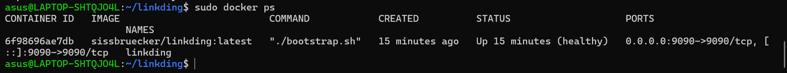
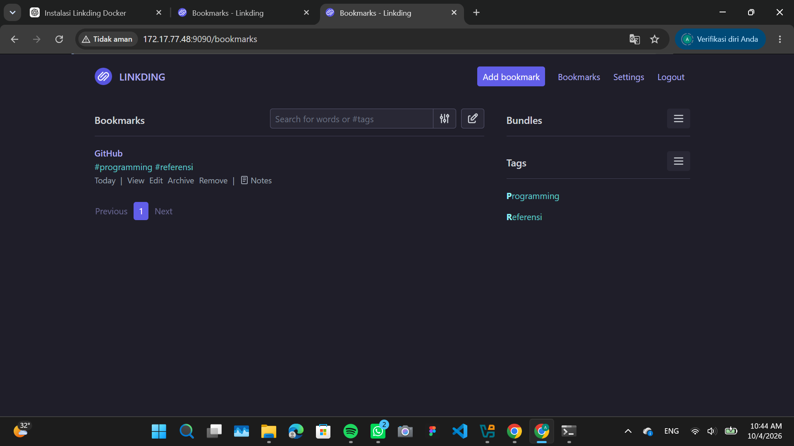
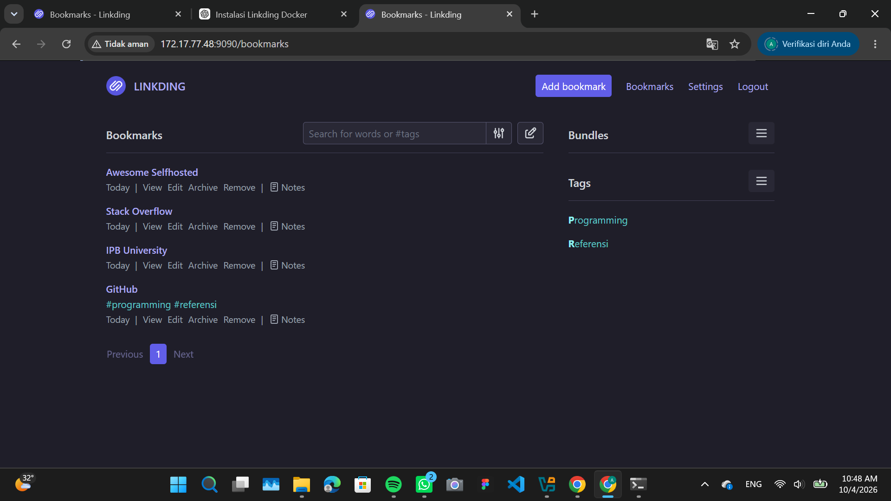

# Aplikasi Web "Linkding"

## Sekilas Tentang

Linkding adalah aplikasi web self-hosted untuk mengelola bookmark atau tautan secara mandiri. Linkding dirancang agar minimal, cepat, dan mudah dijalankan menggunakan Docker.

Linkding dapat digunakan untuk menyimpan dan mengorganisasi bookmark menggunakan tag. Selain itu, Linkding menyediakan fitur seperti pencarian bookmark, bulk editing, notes berbasis Markdown, read later, berbagi bookmark, import dan export bookmark, browser extension, REST API, serta dukungan multi-user.

Pada proyek ini, Linkding diinstal pada VM lokal menggunakan Docker dan Docker Compose.

## Instalasi

### Prasyarat

Sebelum melakukan instalasi Linkding, diperlukan:

- VM lokal dengan sistem operasi Ubuntu
- Koneksi internet
- Docker
- Docker Compose
- Web browser

### Langkah Instalasi

#### 1. Memperbarui repository Ubuntu

```bash
sudo apt update
```

#### 2. Menginstal kebutuhan Docker

```bash
sudo apt install ca-certificates curl
```

Kemudian menambahkan repository Docker:

```bash
sudo install -m 0755 -d /etc/apt/keyrings
```

```bash
sudo curl -fsSL https://download.docker.com/linux/ubuntu/gpg -o /etc/apt/keyrings/docker.asc
```

```bash
sudo chmod a+r /etc/apt/keyrings/docker.asc
```

Menambahkan repository Docker:

```bash
sudo tee /etc/apt/sources.list.d/docker.sources <<EOF
Types: deb
URIs: https://download.docker.com/linux/ubuntu
Suites: $(. /etc/os-release && echo "${UBUNTU_CODENAME:-$VERSION_CODENAME}")
Components: stable
Architectures: $(dpkg --print-architecture)
Signed-By: /etc/apt/keyrings/docker.asc
EOF
```

Kemudian:

```bash
sudo apt update
```

#### 3. Menginstal Docker dan Docker Compose

```bash
sudo apt install docker-ce docker-ce-cli containerd.io docker-buildx-plugin docker-compose-plugin
```

Mengecek status Docker:

```bash
sudo systemctl status docker
```

Docker berhasil berjalan dengan status:

```text
Active: active (running)
```

Mengecek versi Docker:

```bash
docker --version
```

Mengecek Docker Compose:

```bash
docker compose version
```

#### 4. Membuat direktori Linkding

```bash
mkdir -p ~/linkding
cd ~/linkding
```

#### 5. Mengunduh file Docker Compose

```bash
wget https://raw.githubusercontent.com/sissbruecker/linkding/master/docker-compose.yml
```

#### 6. Mengunduh file environment

```bash
wget https://raw.githubusercontent.com/sissbruecker/linkding/master/.env.sample
```

Kemudian membuat file `.env`:

```bash
cp .env.sample .env
```

Struktur file yang digunakan:

```text
linkding/
├── .env
├── .env.sample
└── docker-compose.yml
```

#### 7. Menjalankan Linkding

Linkding dijalankan menggunakan Docker Compose:

```bash
sudo docker compose up -d
```

Hasil proses:

```text
Image sissbruecker/linkding:latest Pulled
Network linkding_default Created
Container linkding Started
```

#### 8. Mengecek container Linkding

```bash
sudo docker ps
```

Hasil pengujian:

```text
STATUS: Up (healthy)
PORTS: 0.0.0.0:9090->9090/tcp
NAMES: linkding
```



#### 9. Membuat akun pengguna

Linkding tidak menyediakan akun awal secara otomatis, sehingga dibuat akun menggunakan:

```bash
sudo docker compose exec linkding python manage.py createsuperuser
```

Kemudian memasukkan username, email, dan password.

#### 10. Mengakses Linkding

IP VM yang digunakan saat pengujian adalah:

```text
172.17.77.48
```

Linkding dapat diakses melalui:

```text
http://172.17.77.48:9090
```



## Konfigurasi

Konfigurasi Linkding dilakukan melalui file `.env` yang dibuat dari `.env.sample`.

Pada instalasi ini digunakan konfigurasi dasar:

- Nama container: `linkding`
- Port host: `9090`
- Direktori data host: `./data`
- Database: SQLite secara default

Port aplikasi dipetakan dari port `9090` pada host ke port `9090` di dalam container.

File Docker Compose juga menggunakan volume data:

```text
./data:/etc/linkding/data
```

Dengan konfigurasi tersebut, data aplikasi disimpan pada direktori data di host.

Tidak terdapat konfigurasi server tambahan seperti reverse proxy atau domain pada instalasi ini karena aplikasi digunakan pada VM lokal.

## Maintenance

Maintenance dilakukan untuk memastikan container Linkding tetap berjalan dan data aplikasi dapat dicadangkan.

### Mengecek container

```bash
sudo docker ps
```

### Melihat log aplikasi

```bash
sudo docker compose logs
```

### Restart container

```bash
sudo docker compose restart
```

### Backup data Linkding

Linkding menyediakan perintah backup penuh untuk database dan data terkait:

```bash
sudo docker exec -it linkding python manage.py full_backup /etc/linkding/data/backup.zip
```

Kemudian file backup dapat disalin ke host:

```bash
sudo docker cp linkding:/etc/linkding/data/backup.zip backup.zip
```

Backup dapat dilakukan secara berkala agar data bookmark tetap dapat dipulihkan apabila terjadi masalah.

## Otomatisasi

Pada instalasi ini proses utama masih dijalankan menggunakan perintah Docker Compose secara manual.

Perintah untuk menjalankan aplikasi:

```bash
sudo docker compose up -d
```

Perintah tersebut dapat digunakan kembali ketika container Linkding perlu dijalankan.

Docker Compose yang digunakan juga memiliki konfigurasi `restart: unless-stopped`, sehingga container akan mencoba berjalan kembali setelah Docker aktif selama container tidak dihentikan secara manual.

## Cara Pemakaian

### 1. Login

Setelah membuka:

```text
http://172.17.77.48:9090
```

pengguna melakukan login menggunakan akun yang telah dibuat pada proses instalasi.

### 2. Menambahkan Bookmark

Untuk menambahkan bookmark, pengguna memilih tombol **Add bookmark**.

Pada pengujian, bookmark yang ditambahkan adalah:

- Title: GitHub
- Tag: programming
- Tag: referensi



### 3. Mengorganisasi Bookmark dengan Tag

Tag digunakan untuk mengelompokkan bookmark berdasarkan kategori tertentu.

Contoh tag yang digunakan:

```text
programming
referensi
```

### 4. Fungsi Utama

Beberapa fungsi utama Linkding yang dapat digunakan antara lain:

- Menambahkan bookmark
- Mengedit bookmark
- Menghapus bookmark
- Mengorganisasi bookmark menggunakan tag
- Mencari bookmark
- Menambahkan catatan
- Archive bookmark
- Import dan export bookmark
- Berbagi bookmark

Linkding juga menyediakan REST API untuk pengelolaan bookmark oleh aplikasi atau script pihak ketiga.

## Pembahasan

### Kelebihan

Menurut hasil penggunaan dan dokumentasi resmi Linkding, beberapa kelebihan aplikasi ini adalah:

- Instalasi relatif sederhana karena dapat dijalankan menggunakan Docker.
- Antarmuka dibuat minimal dan berfokus pada pengelolaan bookmark.
- Bookmark dapat diorganisasi menggunakan tag.
- Mendukung import dan export bookmark.
- Mendukung penggunaan multi-user.
- Memiliki REST API.
- Menggunakan satu container Docker dengan SQLite sebagai database default sehingga relatif mudah dipelihara.

### Kekurangan

Beberapa kekurangan yang dapat diamati dari penggunaan Linkding pada proyek ini adalah:

- Antarmuka lebih berfokus pada fungsi bookmark sehingga fitur kolaborasi dan pengarsipan tidak selengkap beberapa aplikasi sejenis.
- Instalasi dan pengelolaan tetap membutuhkan pemahaman dasar mengenai Docker dan terminal.
- Pada instalasi lokal ini, aplikasi hanya dapat diakses melalui IP VM sehingga belum menggunakan domain atau reverse proxy.

### Perbandingan dengan Linkwarden

Linkding dibandingkan dengan Linkwarden yang juga merupakan bookmark manager self-hosted.

Linkding memiliki pendekatan yang lebih minimal dan ringan. Linkding menggunakan satu container Docker dan SQLite sebagai database default.

Sementara itu, Linkwarden menyediakan fitur yang lebih luas untuk preservation dan kolaborasi. Linkwarden dapat menyimpan salinan halaman dalam bentuk screenshot, PDF, dan file HTML, menyediakan reader view dengan fitur highlight dan annotation, serta mendukung collection dan collaboration.

Berdasarkan fitur tersebut, Linkding lebih sesuai untuk pengguna yang membutuhkan bookmark manager sederhana dengan instalasi dan maintenance yang relatif mudah. Sementara itu, Linkwarden lebih sesuai untuk pengguna yang membutuhkan pengarsipan halaman web dan fitur kolaborasi yang lebih lengkap.

## Referensi

1. Linkding. Dokumentasi resmi Linkding - Installation.
2. Linkding. Dokumentasi resmi Linkding - Options.
3. Linkding. Dokumentasi resmi Linkding - Backups.
4. Linkding. Dokumentasi resmi Linkding - API.
5. Linkding. Dokumentasi resmi Linkding - Admin.
6. Linkwarden. Dokumentasi resmi Linkwarden - Overview.
7. OneStyd. Repository contoh laporan PrestaShop.
